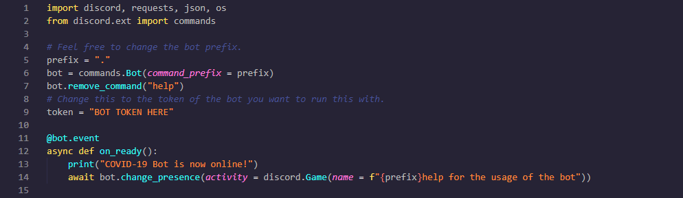

# <u>COVID-19 Discord Satistics Bot</u>
Discord bot that returns covid-19 satistics on a command.

## <u>Preview of Discord bot</u>

##Setup
The setup of this bot is simple. Go and download **[python 3.7]("https://www.python.org/ftp/python/3.7.7/python-3.7.7-amd64-webinstall.exe")**, once the download has completed run the installer, make sure you click "Add To Path". This will allow you to use `pip`. Install the requirements.txt with pip. `pip install -r requirements.txt`

## __**Configuring the bot**__

- **Things to edit:**
    - Edit `line 5` with your custom prefix, the default one is `.`, so to use the bot you would do `.help`.
    - The most import thing to edit the the **token** variable, which is on `line 9`.

After this you have set the bot up. Simply run `python  bot.py` and this will bring the bot online.

## __**Running The Bot 24/7**__
Now the way I told you to run the bot will rely on your computer being online, however there is a great server called **[Heroku]("https://www.heroku.com/")** that you can run the bot on. Here is a **[video]("https://www.youtube.com/watch?v=A97eTCCcw0g")** you can watch to understand how to push the bot and get it running on the service.